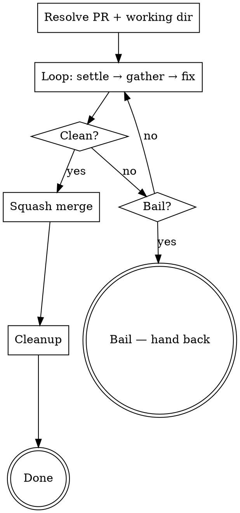

# Ship a PR

Take an existing GitHub PR from "qodo is reviewing" all the way to squash-merged + cleaned up. **Single invocation runs an internal loop** — do not wrap with `/loop`. The loop polls qodo and CI checks, fixes valid feedback, pushes, repeats until clean, then squash-merges and cleans up.

**REQUIRED BACKGROUND:** Follow `superpowers:receiving-code-review` principles when evaluating feedback — verify before implementing, push back on incorrect suggestions with reasoning, no performative agreement.

See `SPEC.md` next to this file for the full design rationale.

## Arguments

Parse `$ARGUMENTS`:
- `<pr-number>` (optional) — PR to ship. If omitted, use the PR for the current branch (`gh pr view --json number,headRefName`). If no PR is associated, stop and ask the user.
- `--confirm-merge` (optional flag) — print a one-line ready-summary and wait for `y/n` before merging. Default is auto-merge.

## High-level flow



## 1. Resolve PR + working directory

```bash
# 1a. PR number
PR=${ARG_PR:-$(gh pr view --json number --jq .number 2>/dev/null)}
[ -z "$PR" ] && { echo "No PR for current branch. Pass a PR number."; exit 1; }

# 1b. Head branch
HEAD_BRANCH=$(gh pr view "$PR" --json headRefName --jq .headRefName)

# 1c. Pick working dir (in order):

# (i) cwd already on the PR branch?
CURRENT=$(git rev-parse --abbrev-ref HEAD 2>/dev/null)
if [ "$CURRENT" = "$HEAD_BRANCH" ]; then
  WORK_DIR=$(pwd)
  CREATED_WORKTREE=false

# (ii) existing worktree on this branch?
elif WT=$(git worktree list --porcelain | awk -v b="refs/heads/$HEAD_BRANCH" '
        /^worktree / { p=$2 }
        $0 == "branch " b { print p; exit }
      '); [ -n "$WT" ]; then
  WORK_DIR="$WT"
  CREATED_WORKTREE=false

# (iii) create one
else
  MAIN_ROOT=$(git rev-parse --path-format=absolute --git-common-dir | xargs dirname)
  git -C "$MAIN_ROOT" fetch origin "$HEAD_BRANCH"
  WORK_DIR="$MAIN_ROOT/.worktrees/$HEAD_BRANCH"
  git -C "$MAIN_ROOT" worktree add -b "$HEAD_BRANCH" "$WORK_DIR" "origin/$HEAD_BRANCH" 2>/dev/null \
    || git -C "$MAIN_ROOT" worktree add "$WORK_DIR" "$HEAD_BRANCH"
  mkdir -p "$WORK_DIR/.claude"
  cp "$MAIN_ROOT/.claude/settings.local.json" "$WORK_DIR/.claude/settings.local.json" 2>/dev/null || true
  cp "$MAIN_ROOT/.claude/settings.json" "$WORK_DIR/.claude/settings.json" 2>/dev/null || true
  CREATED_WORKTREE=true
fi
```

All subsequent work uses `$WORK_DIR`. Use `git -C "$WORK_DIR"` defensively — Claude Code's Bash tool persists cwd, but `-C` is robust.

**Why cwd-first:** the user often checks the PR branch out in their main checkout to test the running app. Don't override that with a worktree.

## 2. The loop

### 2a. Settle phase

Poll every 30s. Settled when:

1. **All checks terminal** (no `pending`/`in_progress`):
   ```bash
   gh pr checks "$PR" --json state --jq '[.[] | select(.state=="PENDING" or .state=="IN_PROGRESS")] | length'
   # 0 = settled
   ```

2. **Qodo's review reflects current HEAD SHA.** Combine two signals (OR — either alone is sufficient):

   **How qodo posts review feedback (read this before writing any poll):** on each push, qodo ALWAYS edits the existing "Code Review by Qodo" issue comment in place — same comment `id`, body replaced with the new findings, `updated_at` advances. It SOMETIMES also posts a new short pointer comment whose body starts with `**[Persistent review](<URL>)** updated to latest commit https://github.com/<owner>/<repo>/commit/<HEAD_SHA>`. The pointer is observed inconsistently — it appears on some pushes (first reviews, certain repo configs) but not others, even when qodo has fully re-analyzed and edited the Code Review comment. Do NOT rely on the pointer's presence as the sole signal. The in-place `updated_at` advance is the reliable one — present on every push.

   **Canonical signal — `updated_at` of the Code Review comment is past the HEAD commit's authored time:**
   ```bash
   HEAD_DATE=$(git -C "$WORK_DIR" log -1 --format=%cI HEAD)
   gh api "repos/{owner}/{repo}/issues/$PR/comments" --jq '
     [.[] | select(.user.login=="qodo-code-review[bot]")
          | select(.body | startswith("<h3>Code Review by Qodo</h3>") or
                          (.body | startswith("\n<h3>Code Review by Qodo</h3>")))
          | select(.updated_at > "'"$HEAD_DATE"'")] | length
   '
   # ≥1 = settled
   ```
   Works on every iteration — qodo always edits this comment in place after re-analyzing. Use this as the primary settle check.

   **Optional fast-path — pointer comment names current HEAD SHA:**
   ```bash
   HEAD_SHA=$(git -C "$WORK_DIR" rev-parse HEAD)
   gh api "repos/{owner}/{repo}/issues/$PR/comments" --jq '
     [.[] | select(.user.login=="qodo-code-review[bot]")
          | select(.body | startswith("**[Persistent review]"))
          | select(.body | contains("'"$HEAD_SHA"'"))] | length
   '
   # ≥1 = settled
   ```
   When this fires, you can skip the `updated_at` check — but **never block on it**. Its absence is not a "qodo hasn't caught up" signal; qodo posts the pointer inconsistently. If you wait for it exclusively after the in-place edit has already happened, the loop hangs indefinitely (this happened on PR #148, iteration 2 — qodo edited Code Review with `🐞 Bugs (0)` but never posted a pointer).

   > **Don't:** write your own poll that fetches qodo's comments, sorts by `created_at`, takes the latest, and greps for `Bugs (N)` or other findings-shaped patterns. Qodo does NOT post a new analysis comment per push — it edits the existing Code Review comment in place. A "latest comment + grep for findings" loop will wait forever. Use the canonical `updated_at`-based check above.
   >
   > **Also don't:** make the pointer check `AND`-required with anything. It must be `OR` only (or omitted) — see PR #148, iteration 2 for the failure mode.

3. **≥60s since last check completed** — gives bots time to post.

**Status updates while waiting** (every 2–3 min): `Waiting for checks... 3/7 complete | qodo: caught up ✓ | 4 min elapsed`.

**Fallback nudge:** if 3 min pass after our latest push with qodo signal still false, post `/review` as an issue comment to retrigger. Once per push.
```bash
gh api "repos/{owner}/{repo}/issues/$PR/comments" -f body="/review"
```

**Timeout:** 15 min per settle phase. On timeout: print `Settle timeout — proceeding with current state`, continue to 2b. Don't bail — there may still be feedback to fix.

### 2b. Gather feedback (5 sources)

```bash
gh api "repos/{owner}/{repo}/pulls/$PR/comments"     # 1. review threads
gh api "repos/{owner}/{repo}/pulls/$PR/reviews"      # 2. reviews
gh api "repos/{owner}/{repo}/issues/$PR/comments"    # 3. issue comments (qodo)
gh pr checks "$PR" --json name,state,conclusion      # 4. check runs
gh pr view "$PR" --json mergeable,mergeStateStatus   # 5. mergeability
```

For check failures, fetch logs: `gh run view "$RUN_ID" --log-failed`.

**Reading the current qodo analysis:** the actual findings live in the "Code Review by Qodo" issue comment whose body starts with `<h3>Code Review by Qodo</h3>` (possibly with a leading newline). Qodo edits this comment in place per push, so its current `body` is always the latest analysis. Do NOT rely on `created_at` ordering — after qodo has updated, this comment is the OLDEST qodo comment on the PR, not the latest. Filter by body prefix, not recency.

Use `mcp__github__pull_request_read` if available (cleaner shape).

### 2c. Exit check (when to merge)

ALL must be true:
- No FIX items in this iteration's categorized feedback.
- All checks `success`/`skipped`/`neutral` (no `failure`/`cancelled`/`timed_out`/`action_required`/`startup_failure`/`stale`).
- Qodo's persistent review reflects current HEAD SHA (same check as 2a).
- `mergeable == "MERGEABLE"` AND `mergeStateStatus ∈ {"CLEAN", "UNSTABLE"}`.

If true → jump to step 3 (merge). Else → 2d.

### 2d. Categorize feedback

Per `superpowers:receiving-code-review`:

1. Read referenced code in `$WORK_DIR`. Don't trust the reviewer.
2. Check if already fixed in subsequent commits.
3. Evaluate technically for THIS codebase (CLAUDE.md conventions).
4. Categorize each item:
   - **FIX** — valid issue, will address.
   - **SKIP-ALREADY-FIXED** — addressed in a later commit.
   - **SKIP-DESIGN-DECISION** — intentional choice; reply with reasoning.
   - **SKIP-INCORRECT** — reviewer is technically wrong; reply with reasoning.
   - **SKIP-SUBJECTIVE** — style preference without clear benefit; reply briefly.

**SKIP-\* items are replied-to but DO NOT block the merge gate.** Priority for FIX: Security > Bugs > CLAUDE.md violations > Code quality > Style.

**Track each item by a stable fingerprint** (used by 2g bail check):
- Review-thread comment: `(file, line, comment_id)`.
- Issue-comment finding (qodo): `(file, line, normalized first ~60 chars of finding text)`.
- Check failure: `(check_name, first non-empty error line)`.

### 2e. Resolve merge conflicts (if any)

If `mergeable == "CONFLICTING"` or `mergeStateStatus == "DIRTY"`, conflicts come BEFORE other fixes:

```bash
git -C "$WORK_DIR" fetch origin
BASE=$(gh pr view "$PR" --json baseRefName --jq .baseRefName)
git -C "$WORK_DIR" merge "origin/$BASE"
```

If conflicts: read each conflicted file, understand both sides, keep intent of both where possible. If base removed code → keep the removal (likely intentional). If both sides materially changed the same lines and intent isn't obvious → **bail** (2g condition 3). After resolution, run verification gates, commit, push, loop back to 2a.

### 2f. Fix valid issues + verify + push

For each FIX item:
1. Read the file(s) first. Don't edit blind.
2. Make minimal, focused edits — don't expand scope.

Then run CLAUDE.md verification gates from `$WORK_DIR`. For foster-clarity:
```bash
pnpm check-types && pnpm lint && pnpm test && pnpm format:check
# Plus pnpm build if apps/web was touched
```

If any gate fails → fix isn't done. Iterate until gates pass.

```bash
git -C "$WORK_DIR" add <specific files>
git -C "$WORK_DIR" commit -m "fix: address PR review comments

<one-line per fixed item>

Co-Authored-By: Claude <noreply@anthropic.com>"
git -C "$WORK_DIR" push origin "$HEAD_BRANCH"
```

### 2g'. Resolve threads / reply

#### Review threads (resolvable, inline)

For FIX items, resolve via GraphQL:
```bash
# Fetch thread node IDs
gh api graphql -f query='
  query($owner:String!,$repo:String!,$pr:Int!) {
    repository(owner:$owner,name:$repo) { pullRequest(number:$pr) {
      reviewThreads(first:100) { nodes { id isResolved
        comments(first:1) { nodes { databaseId body path line } } } } } }
  }' -f owner=<owner> -f repo=<repo> -F pr=$PR

# Resolve
gh api graphql -f query='
  mutation($id:ID!) { resolveReviewThread(input:{threadId:$id}) { thread { isResolved } } }
' -f id="$THREAD_NODE_ID"
```

For SKIP items, reply explaining why:
```bash
gh api "repos/{owner}/{repo}/pulls/$PR/comments/$COMMENT_ID/replies" \
  -f body="Not addressed — <reason: e.g., intentional design choice because X>."
```

#### Issue comments (not resolvable)

Reply once with fixed + skipped summary:
```bash
gh api "repos/{owner}/{repo}/issues/$PR/comments" -f body="$(cat <<'EOF'
Addressed the review feedback:

**Fixed:**
- <item>: <what was done>

**Not fixed (with reasoning):**
- <item>: <reason>
EOF
)"
```

Always reply, even if everything was skipped. Don't reply if the comment had no actionable feedback.

#### Review bodies

If body had actionable feedback, reply as issue comment summarizing. Skip if it was just APPROVE / "lgtm".

### 2g. Bail conditions

Check before looping back to 2a:

1. **Same feedback survived two rounds.** Compare iteration N's fingerprint set to N+1's. If any item we attempted to fix in N reappears in N+1 → bail.
2. **CI check failed AND we can repro locally.** For each red check, try to reproduce in `$WORK_DIR`. If local reproduction also fails after our fix → bail. (Vercel-only failures we can't repro → also bail; needs human to check env.)
3. **Merge conflict needs human judgment.** If both sides of a conflict materially changed the same lines and intent isn't obvious → bail.

**Bail action:**
1. Stop the loop. Do NOT merge.
2. Post status comment on PR:
   ```
   /pr-ship paused — needs human review:
   • <bail reason>
   • <what was attempted>
   • <what's left unresolved>
   ```
3. Print same summary to terminal + PR URL.
4. If `CREATED_WORKTREE=true`, leave the worktree in place.
5. Exit non-zero.

### Otherwise — loop back to 2a

If no bail and there's still feedback or CI is red, return to 2a. The next settle phase waits for the new push to be reviewed.

## 3. Squash merge

Reached only when 2c's exit check passed.

### Default mode

```bash
gh pr merge "$PR" --squash --delete-branch
```

`--delete-branch` deletes the **remote** branch. Local + worktree cleanup is step 4.

### `--confirm-merge` mode

Print one-line summary and prompt:
```
PR #$PR is clean.
• qodo ✓ on $HEAD_SHA
• <N> checks green
• <M> comments resolved (<F> fixed, <S> skipped with reasoning)
• Last commit: <abbrev SHA> "<msg>"

Squash-merge now? [y/N]
```

Wait for `y` (case-insensitive). Anything else → exit without merging, leave PR + worktree as-is.

If `y` → run the same `gh pr merge --squash --delete-branch`.

### Verify merge

```bash
gh pr view "$PR" --json state,mergedAt --jq '.state + " " + (.mergedAt // "never")'
# Expected: "MERGED <timestamp>"
```

If not merged (e.g., race condition where a check went red between exit check and merge) → report error, bail, don't continue to cleanup.

## 4. Cleanup

```bash
# 4a. Find main checkout root (always first entry in worktree list)
MAIN_ROOT=$(git -C "$WORK_DIR" worktree list --porcelain | awk '/^worktree / { print $2; exit }')

# 4b. Switch to default branch in main checkout
DEFAULT=$(gh repo view --json defaultBranchRef --jq .defaultBranchRef.name)
git -C "$MAIN_ROOT" checkout "$DEFAULT"
git -C "$MAIN_ROOT" pull origin "$DEFAULT"

# 4c. Delete the worktree FIRST (if we created it), then the branch.
# Order matters: branch -D fails if the branch is checked out anywhere.
if [ "$CREATED_WORKTREE" = "true" ]; then
  git -C "$MAIN_ROOT" worktree remove "$WORK_DIR" --force
fi
git -C "$MAIN_ROOT" branch -D "$HEAD_BRANCH"

# 4d. Prune stale remote refs
git -C "$MAIN_ROOT" fetch --prune
```

If `WORK_DIR == MAIN_ROOT` (user was on the PR branch in main checkout), no worktree to remove — the `checkout DEFAULT` step already moved them off the doomed branch.

## 5. Final report

```
✓ PR #N squash-merged: <pr URL>
✓ Branch <HEAD_BRANCH> deleted (local + remote)
[✓ Worktree removed: <path>]   ← only if CREATED_WORKTREE
✓ Now on <DEFAULT> @ <new sha>

Summary:
  <N> rounds of fixes
  <F> issues fixed, <S> skipped with reasoning
  <C> checks green
  Total time: <duration>
```

## Important notes

- All file reads/edits during the loop must use paths within `$WORK_DIR`.
- Run verification gates from `$WORK_DIR`, not the main checkout.
- Don't run `pnpm dev` / `pnpm deploy:dev` from a worktree if the main checkout's dev server is running — they'll collide on ports / shared backends.
- When pushing back on a suggestion, reply with technical reasoning, not just "skipped".
- The loop is INTERNAL to one invocation. Do NOT use `/loop` to wrap this skill — `/loop` is for skills that do single passes.
- If the user is already inside a worktree on the PR branch when invoking, that worktree is preserved after merge (only the branch is deleted). They might want to keep working there.
